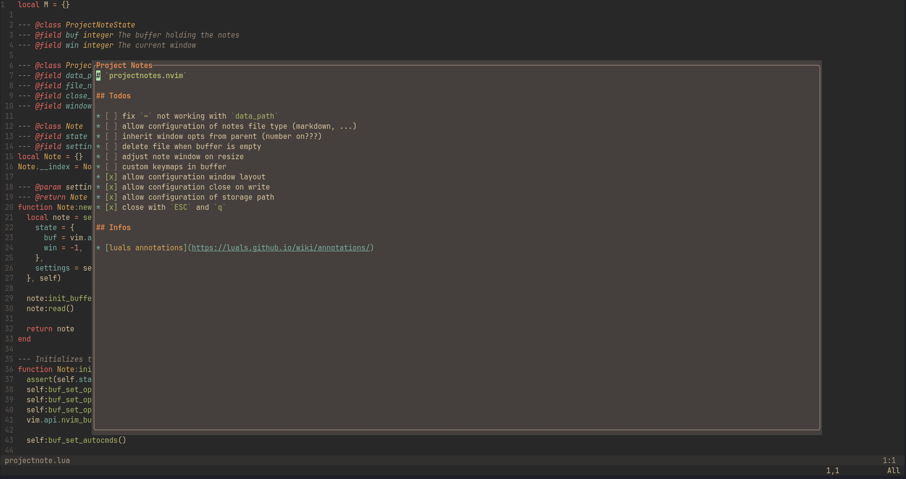

<div align="center">

# projectnote.nvim (WIP)

#### Quickly take notes for your projects in Neovim without worrying about where to put them. 

[](http://www.lua.org)
[](https://neovim.io)



</div>

## Installation

Using [lazy](https://github.com/LazyVim/LazyVim)
```lua
{
  'icemau/projectnote.nvim',
}
```

## Usage

After installing you can start requiring this plugin and configure your own keymaps.

A basic setup, where you assign a single keymap for toggling the note window, would look something like this.
```lua
{
  'icemau/projectnote.nvim',
  config = function()
    local note = require('projectnote').setup {}
    vim.keymap.set('n', '<leader>tn', function () note:toggle() end, {})
  end
}
```

## Options

There are a few options to set when calling `setup`.

```lua
require('projectnote').setup {
    -- These are the default values

    -- Where to store your notes
    data_path = string.format("%s/projectnote", vim.fn.stdpath("data")),

    -- When `true` close the note window automatically on `:w`
    close_write = false,

    -- Where to draw the note window.
    -- Allowed values are "CENTER", "RIGHT", "LEFT", and "FULLSCREEN".
    window_layout = "CENTER",
}
```


## API

The `Note` table returned by `require('projectnote').setup {}` provides a few functions for you to customize your experience.

| Method           | Description                          |
| ---------------- | ------------------------------------ |
| `note:toggle()`  | Toggles (open/close) the note window |
| `note:open()`    | Opens the note window                |
| `note:close()`   | Closes the note window               |
| `note:is_open()` | Returns `true` if the note is open   |

Please note that there are more functions but please do not use them.
They will change and I can not assure you that nothing will break if you use them.
